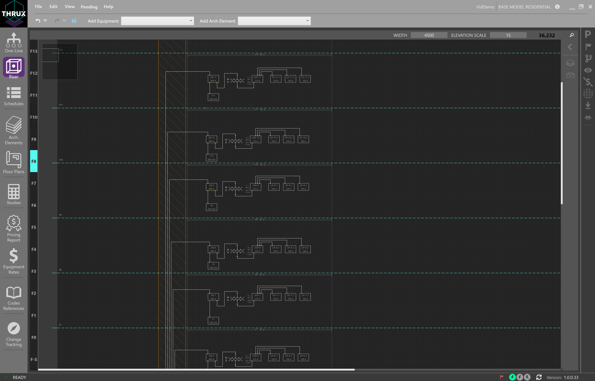
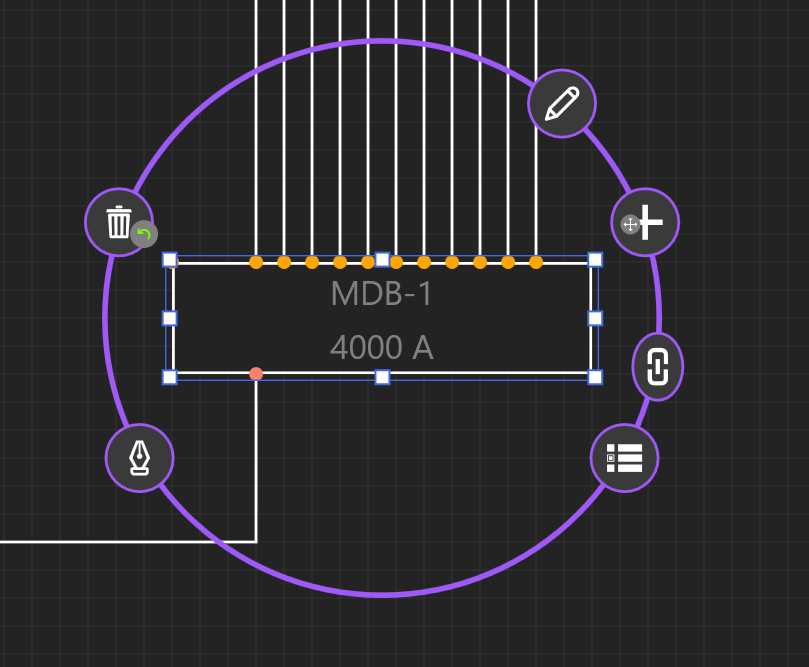
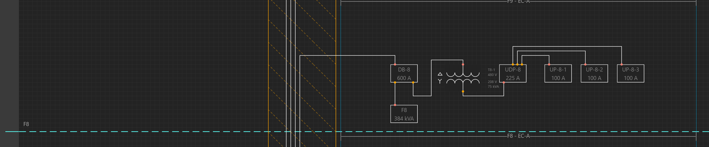
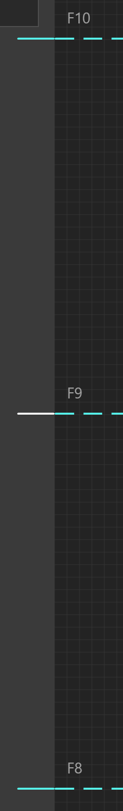
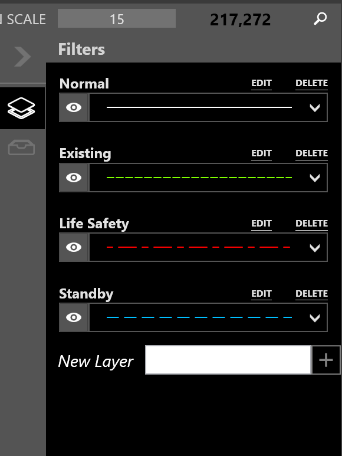
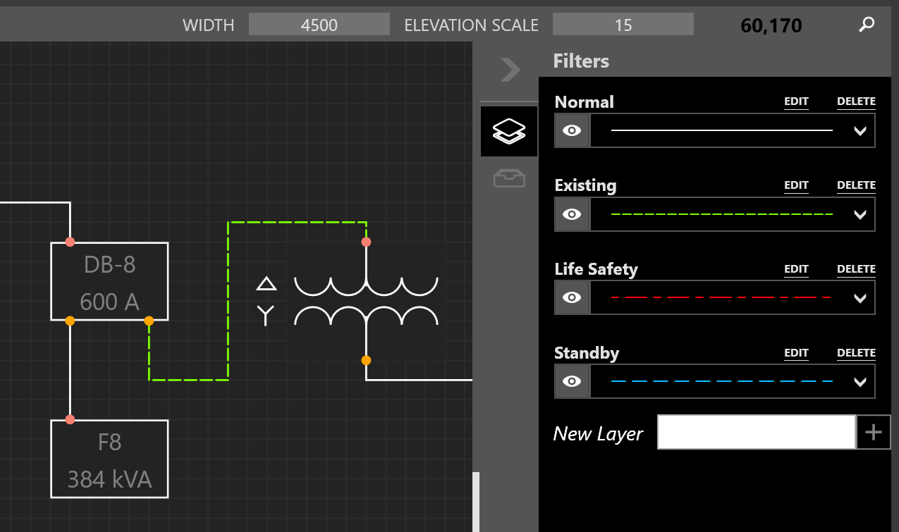
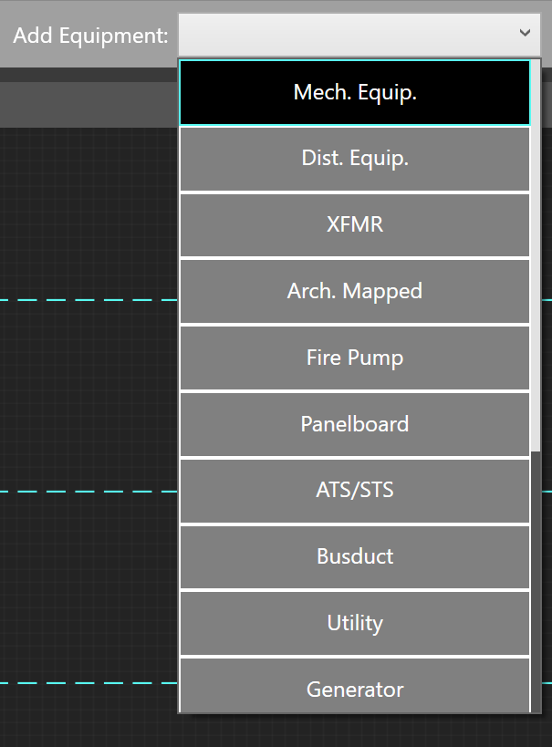
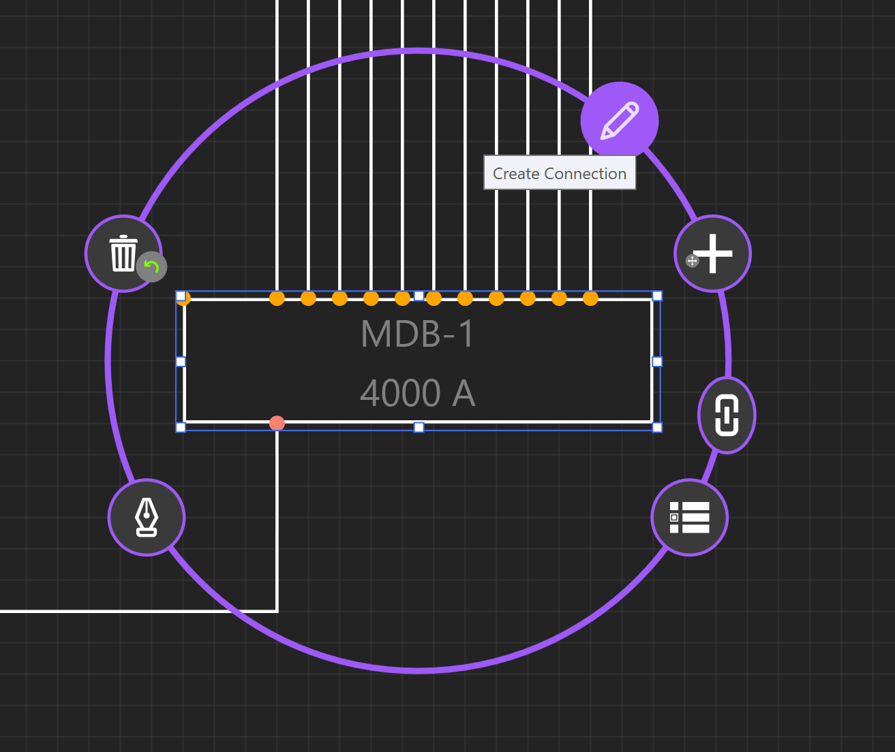
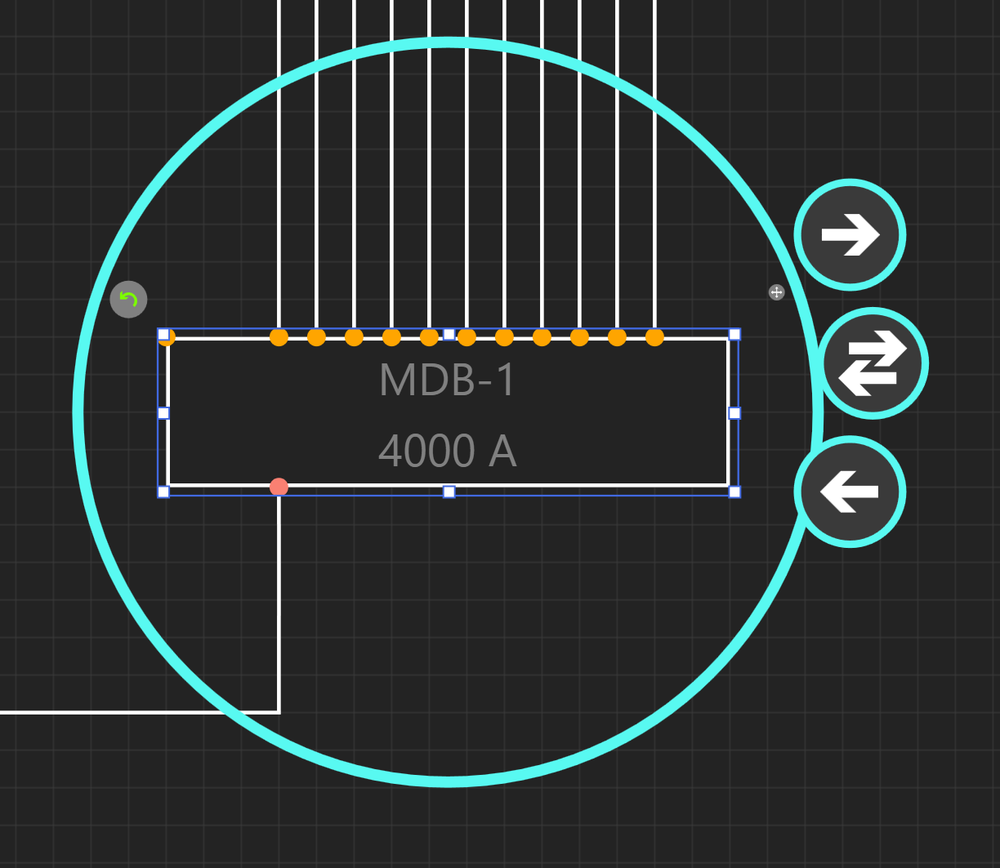
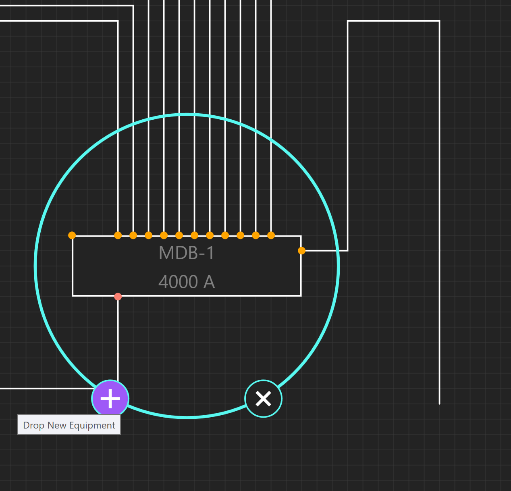

#########
**Riser**
#########

The Riser workspace is an elevational representation of the distribution system.  It is used to depict wiring routes as they disperse through a vertically scaling project.

Note that the interactions between the Riser, One-Line, and Schedules are similar.

Navigation Overview
===================

Floor Navigator
---------------

On the left, is a Floor navigator.  It will track and navigate to the selected floor, highlighted in cyan.  

Floors are denoted by the dashed cyan regions, while Rooms are denoted by the solid cyan regions.

Use the floor grip on the left of each floor, highlighted white, to adjust the height and region of the floor.

Riser Toolbox
-------------

On the right is the Riser Toolbox, which allows the designer to search for equipment, control layers of the circuits between equipment, and view Unhosted Equipment.  

Unhosted Equipment are pieces of equipment which do not have a Room.  Drag these equipment into Room regions to place the equipment on the Riser.

.. image:: images/riser-toolbox_unhosted_equipment.PNG
    :align: center

Add Architectural Elements
==========================

To add Floors, Rooms, Architectural Elements, or electrical Equipment, use the toolbox at the top.

Drag and drop elements from the toolbox to the workspace to place elements.

.. image:: images/riser-arch_toolbox_add_arch.PNG
    :align: center

Add Electrical Equipment
========================

To place Equipment, drag and drop elements from the toolbox into the workspace.

To place an Equipment in a Room, drag the Equipment into the Room region.

.. image:: images/riser-arch_toolbox_add_equip_2.PNG
    :align: center

Connecting Equipment
====================

There are three different types of connections between equipment: Outbound, Tie, and Infed, or Source, Load, and Tie, respectively.

To create a connection between equipment, select the equipment.  Then choose Create Connection.

Then choose Outbound connection.  This will create a new circuit from your equipment to your load.

Draw out your connection using your mouse, and choose Drop New Equipment.  

Click the + button for Drop New Equipment.

