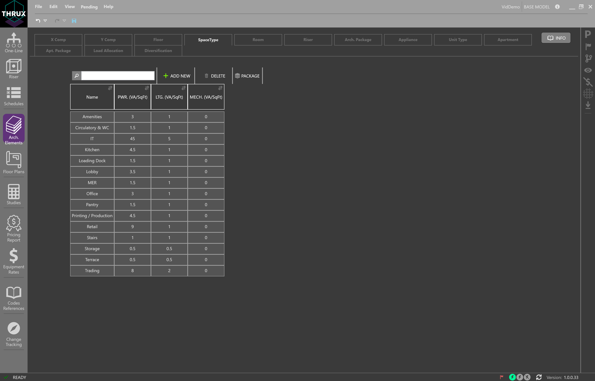
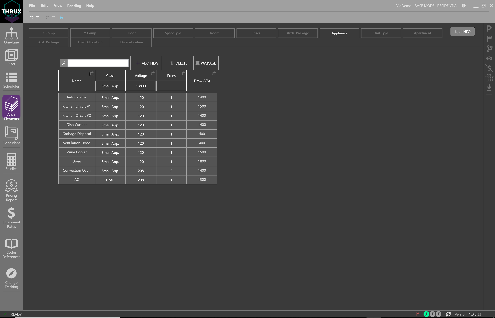
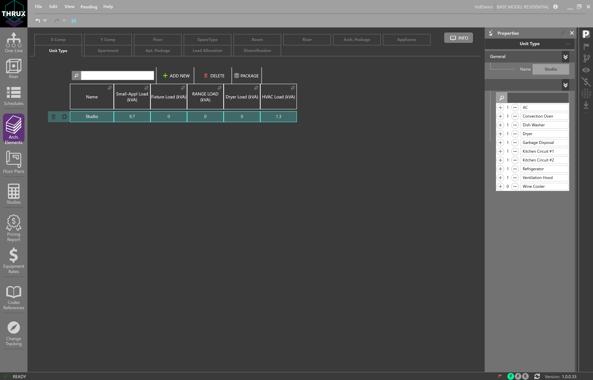
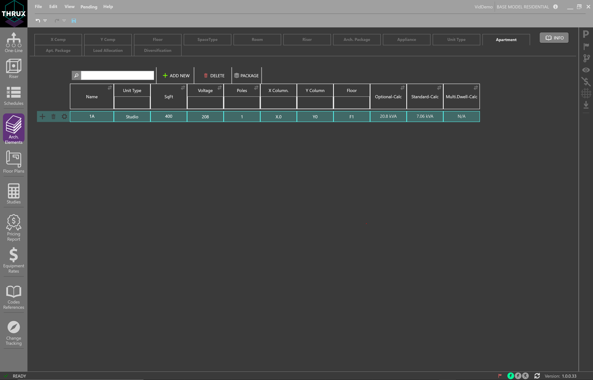
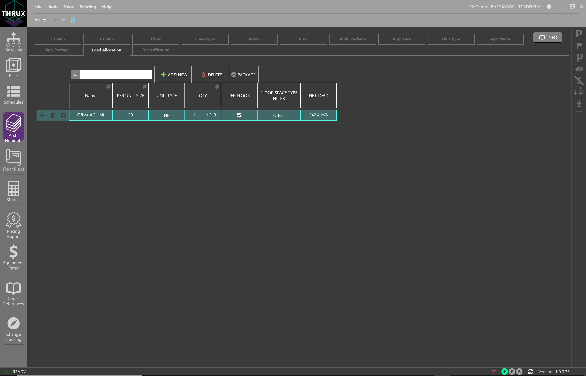

.. _Arch.-Elements:

Architectural Elements
======================

X Grid / Y Grid
---------------

X Grid and Y Grid components are used to establish a location for Rooms.  Equipment are placed inside Rooms, which are effected by point to point calculations.

.. image:: images/XGrid_YGrid.PNG
    :align: center

Floor
-----

Floors are used for power density calculations, and to also house rooms.  

.. image:: images/Floor.PNG
    :align: center

Space Type
----------

Space Types are used to assign power densities to architectural entities such as Floors and Rooms.  

For example, engineers perform load massing calculations in order to size their main distribution equipment.  They allocate power differently for floor loads, lighting loads, and mechanical loads.  

A variety of Space Types allows the engineer to study power density requirements of the project.

Room
-----

Rooms are used to establish locations for equipment.  Based on these locations, engineers can perform their point to point calculations.  Rooms can also be packaged to create custom load packages.

.. image:: images/Room.PNG
    :align: center

Riser
-----

A Riser is an entity which is used to offset conduit routes.  By default, the length of a conduit route is determined by the the distance between the source and the load.  However, engineers are often allocated Risers, or shaft space, to house their conduits, or feeders.  The conduits are routed from their source, through the Riser, and terminate at the load.

.. image:: images/Riser.PNG
    :align: center

Arch. Package
-------------

Architectural Packages are used to model the load, or power density, of a group of architectural elements.  

For example, a group of floors could each have their SpaceType designated as Office, which has a specific power density.  This group of floors can be packaged as a load, and fed from a distribution equipment.

To create a Load Package, within Architectural Elements, select a group of Floors, or Rooms.  In the orange textbox, enter a name for the Load Package, and then click the (+) button.  To view your Load Packages, click the Arch. Package tab.  These packages can be attached to any distribution board in the network.

.. image:: images/Architectural_Package.PNG
    :align: center

Appliance
---------

Appliances are used to calculate the load of residential projects.  Appliances are assigned to a Unit Type.

Unit Type
---------

Unit Types are used to group Appliances together, in order to calculate the load of residential projects.  A Unit Type is assigned to an Apartment.

Apartment
---------

An Apartment contains a Unit Type.  It also contains information regarding its location, and loading information.  A group of Apartments can make up an Apt. Package, or Apartment Package.

Apt. Package
------------

Apt. Package, or Apartment Packages are used to group Apartments together in order to calculate a load.  

.. image:: images/Apartment_Package.PNG
    :align: center

Load Allocation
---------------

Load Allocations are used to supplement the Architectural Packages.  In addition to floor or room power densities, power can be allocated to specific floors.

A designer may want to account for a load which only occurs on floors of a specific Space Type.  For example, if a designer wanted to account for a 20 HP motor on every Office Floor, they would need to create a new Load Allocation.  Then, they would filter that Allocation by the Floor Space Type, and add it to an Architectural Package.

Diversification
---------------

Diversifications allows the designer to create customizable diversity factors which can be applied to different sections or levels of the distibrution system.  

A Root Diversity is a factor applied to Root Level loads.  A Root Diversity cannot be less zero and cannot be greater than the Distribution Diversity.

A Distribution Diversity is a factor applied to Distribution Level loads.

An End of Line Diversity is a factor applied to End of Line Loads.

.. image:: images/Diversification.PNG
    :align: center
