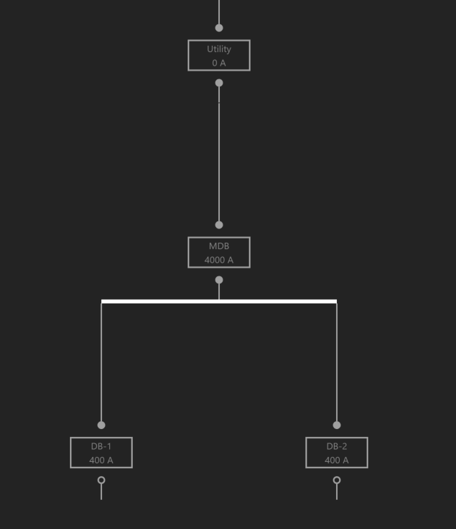
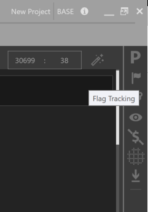
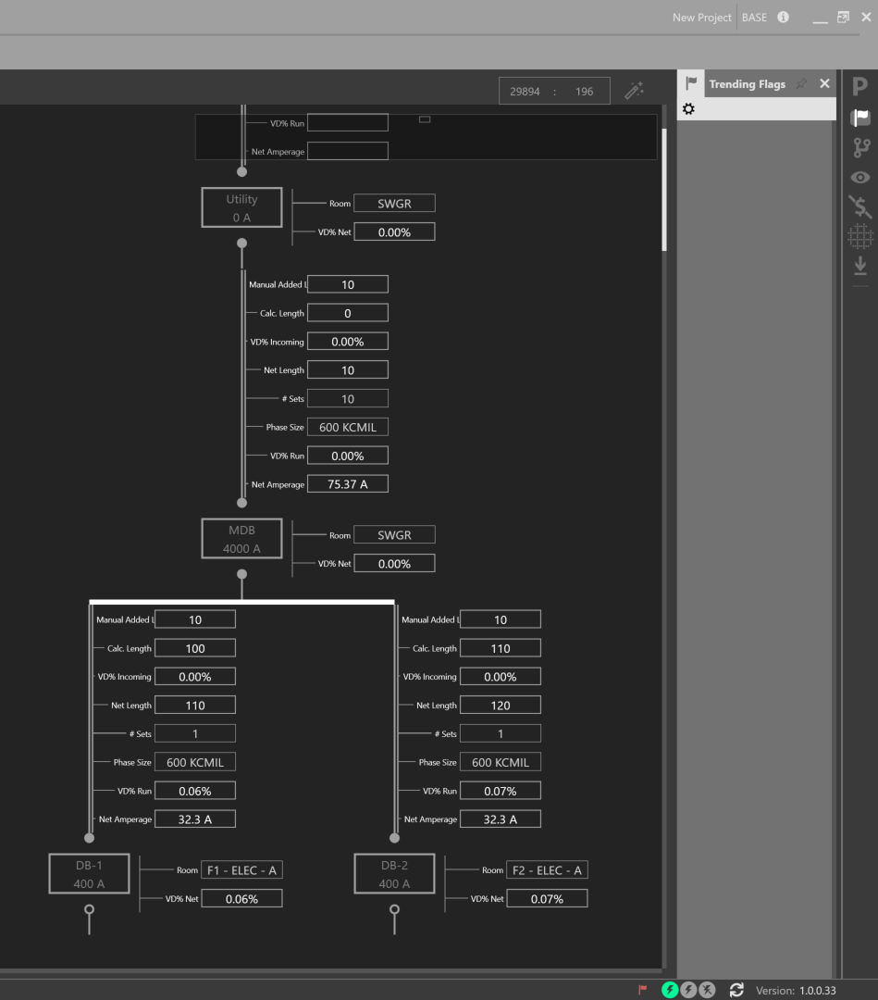
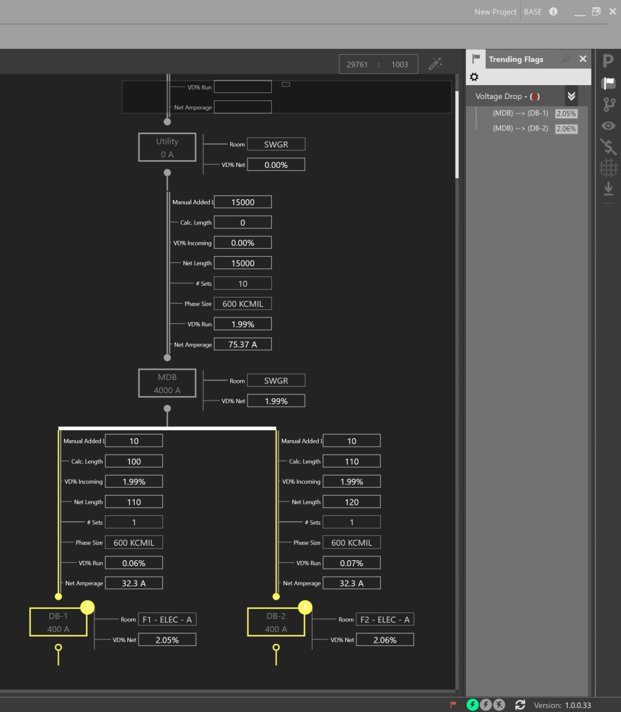

Identifying Design Flaws Using FlagTracker
------------------------------------------
Below is a small example showing a Utility source, and a Main Distribution Board which feeds downstream Distribution boards.

Open the FlagTracker by clicking on the right explorer dock.  Note that the current list of flags is empty.  

Enable the Voltage Drop Quick View, in addition to the Calculated Length and Manual Added Length Property Tags. 

Increase the Manual Added Length to 15000 for the circuit feeding the MDB Distribution Board and note the list of current flags.

