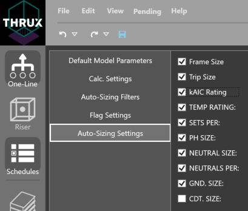

Auto-Sizing Settings
====================
THRUX will calculate equipment sizes automatically, but certain parameters can be excluded in the Auto-Sizing settings.  

For example, if the designer would like a conduit size to remain constant or intentionally oversized to account for shaft space, deselect Conduit Size shown below.

Frame Size
----------
Deselect Frame Size to omit the Frame Size from being recalculated upon changes to circuit properties.

Trip Size
----------
Deselect Frame Size to omit the Trip Size from being recalculated upon changes to circuit properties.

kAIC Rating
-----------
Deselect Frame Size to omit the kAIC Rating from being recalculated upon changes to circuit properties.

Temperature Rating
------------------
Deselect Frame Size to omit the Temperature Rating from being recalculated upon changes to circuit properties.

Sets Per
--------
Deselect Frame Size to omit the Sets Per from being recalculated upon changes to circuit properties.

Phase Size
----------
Deselect Frame Size to omit the Phase Size from being recalculated upon changes to circuit properties.

Neutral Size
------------
Deselect Frame Size to omit the Neutral Size from being recalculated upon changes to circuit properties.

Neutrals Per
------------
Deselect Frame Size to omit the Neutrals Per from being recalculated upon changes to circuit properties.

Ground Size
-----------
Deselect Frame Size to omit the Ground Size from being recalculated upon changes to circuit properties.

Conduit Size
------------
Deselect Frame Size to omit the Conduit Size from being recalculated upon changes to circuit properties.
