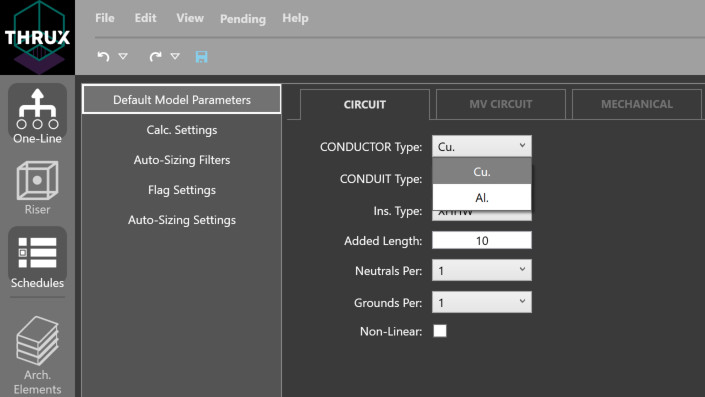

Default Model Parameters
========================

The entities or objects you will use to build your model need to have some initial or base information.  For example, to build your entire model using aluminum, select the Conductor Type from the dropdown below:

Circuit
--------

Specify the characteristics of each feeder circuit. 

For example, "Added Length" is an additional factor which is added a circuit's "Calculated Length."  Lengths are determined by equipment locations.

MVCircuit
---------

Specify the characteristics of each MV feeder circuit. 

Mechanical
----------

Specify the characteristics of each Mechanical equipment. 

Dist. Board
-----------

Specify the characteristics of each Distribution Board. 

Bus Duct
--------

Specify the characteristics of each Bus Duct. 

XFMR
----

Specify the characteristics of each XFMR. 

Panelboard
----------

Specify the characteristics of each Panelboard. 

ATS
---

Specify the characteristics of each ATS. 

Utility
-------

Specify the characteristics of each Utility. 

Generator
---------

Specify the characteristics of each Generator. 
